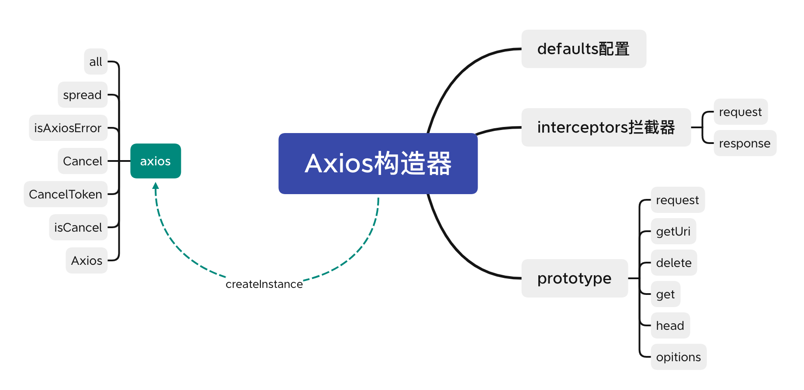

### axios源码阅读体会

- 
- 注意：macOS下针对github图片访问资源问题，需将上传后图片的域名对应的ip地址，添加到本地host文件的白名单中，macOS查找域名ip命令👉：nslookup raw.githubusercontent.com
- axios是Axios构造器函数的实例化对象，基于javascript对象的继承原理，所有axios上的常用方法都继承于构造器函数。
